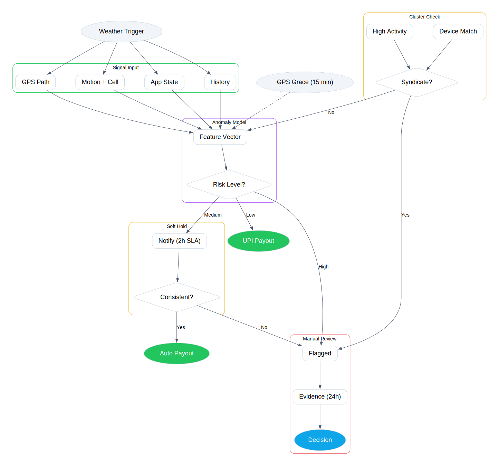

  
  
  <h1>CashUrance: AI-Powered Income Protection for Delivery Partners</h1>
  
<b>Developed by Team D.E.V (Deploy - Execute - Vanish)</b>

> **Guidewire DEVTrails 2026 - Phase 1 Submission** &nbsp;|&nbsp; **Theme:** Ideate & Know Your Delivery Worker

**CashUrance** is an AI-enabled, event-driven parametric insurance platform designed exclusively for India's food and Q-commerce delivery partners (e.g., Zomato, Swiggy, Zepto). It provides a robust financial safety net against uncontrollable external disruptions, ensuring that when extreme weather halts deliveries, income stability is maintained.

---

## The Problem & Target Persona

* **Target Persona:** Food & Q-Commerce Delivery Partners.
* **The Vulnerability:** The delivery ecosystem is highly sensitive to sudden environmental disruptions such as severe waterlogging or extreme heatwaves. While consumer order demand often spikes during these events, the physical inability of partners to deliver safely results in a complete loss of their daily wages.
* **Coverage Scope:** Strictly limited to **Loss of Income**. This platform explicitly excludes coverage for health, life, accidents, or vehicle repairs, adhering to the core parametric constraint.

---

## Core Strategy & Operational Workflow

Our solution transitions from traditional, manual claims processing to real-time, data-driven automation utilizing an **Event-Driven Architecture**.

1. **Onboarding & Risk Profiling (Sunday):** A delivery partner registers on the platform. The system evaluates their primary operating zone and assigns a baseline risk tier utilizing clustering algorithms.
2. **Dynamic Premium Calculation (Sunday Night):** The predictive engine evaluates the 7-day weather forecast for the specific operating zone. It calculates a dynamically adjusted **Weekly Premium** (e.g., ₹85/week) based on the calculated expected loss. The partner opts in.
3. **The Disruption (Wednesday 3:00 PM):** A severe weather event occurs. The integrated meteorological API triggers a real-time alert for conditions crossing our established parametric threshold (e.g., rainfall >65mm).
4. **Validation & Payout (Wednesday 3:05 PM):** The system verifies the partner's "propensity to work" to confirm actual income loss and executes a rapid fraud detection protocol. Validated claims result in an automated, instant payout for lost hours via UPI.

---

## Platform Architecture: Mobile-First Approach

**CashUrance** is developed as a native **Mobile Application**.

Delivery partners operate entirely via their mobile devices. A web-based platform introduces unnecessary operational friction. A mobile-first architecture enables:
* Background location validation for robust fraud detection.
* Instant push notifications for impending environmental alerts.
* Seamless UPI API integration for one-click weekly premium payments and instant claim disbursements.

---

## AI & ML System: Models and Microservices

The system architecture decouples complex machine learning tasks into specialized microservices, ensuring high scalability, low latency, and strict interpretability for auditing purposes. 

### ML Module Overview

| Module | AI/ML Model | Function & Integration |
| :--- | :--- | :--- |
| **Premium Calculation** | CatBoost + SHAP | Dynamically calculates the weekly premium based on historical weather, zone, and platform data. SHAP ensures model explainability. |
| **Active Shift Validation** | Logistic Regression | Evaluates the partner's "Propensity to Work" based on rolling 3-week login habits, ensuring payouts are only distributed for actual planned income loss. |
| **Parametric Trigger** | Rule-Based Logic | Deterministic disruption detection. Subscribes to a message broker (Redis/Kafka) to execute triggers instantly upon receiving severe API alerts. |
| **Fraud Detection** | Isolation Forest | Identifies anomalous operational behavior (GPS spoofing, impossible travel velocities) operating in parallel with a strict heuristic rule layer to prevent duplicate claims. |
| **Risk Profiling** | K-Means Clustering | Segments the delivery fleet into structured risk tiers during onboarding to optimize initial pricing and insurer capital allocation. |

---

## Fraud Prevention & Anti-Spoofing Strategy

To ensure platform sustainability, our system assumes GPS can be spoofed. Therefore, we rely on a **multi-signal behavioral approach** evaluated by our Isolation Forest model. No single anomaly triggers a rejection; instead, the system looks for an overall pattern of legitimate work.

### The 3 Pillars of Verification

Instead of relying solely on coordinates, we validate claims across three dimensions:

1. **Location & Movement:** We check for realistic travel trajectories and speeds leading up to the weather event, automatically flagging impossible GPS jumps or completely stationary devices.
2. **Platform Behavior:** We verify that the user was actively engaging with the delivery app (accepting orders, normal screen time) before the disruption, rather than just turning the app on to claim a payout.
3. **Device & Network Integrity:** We cross-reference GPS data with network types and device fingerprints to catch emulators or location-spoofing apps.

### Multi-Signal Feature Vector

Our Isolation Forest evaluates the following combined feature set across the three pillars. No single signal causes an automatic rejection:

| Signal | What It Detects |
| :--- | :--- |
| **Trip trajectory continuity** | Movement matches claimed zone |
| **Timestamp consistency** | Human-like activity intervals |
| **App foreground activity** | App usage at trigger time |
| **Battery / network fluctuation** | Outdoor usage vs idle device |
| **Order acceptance history** | Active delivery participation |
| **Speed & route plausibility** | Realistic travel behavior |
| **Accelerometer / Gyroscope** | Motion vs stationary device |
| **Cell tower triangulation delta** | GPS vs network mismatch |
| **Device fingerprint consistency** | Reused / emulator devices |
| **Network type** | Wi-Fi vs mobile anomaly |

### Handling Edge Cases & Syndicates

* **Syndicate Detection:** A parallel cluster analysis monitors for coordinated fraud rings, flagging impossible scenarios (e.g., 50 claims originating from the exact same stationary coordinate within 5 minutes).
* **Fairness First (The 15-Minute Grace Period):** We recognize that severe weather causes network drops. If a worker's GPS drops out during an active storm alert, the system caches their last valid location for 15 minutes to ensure legitimate workers aren't unfairly denied their payout.

### Anti-Spoofing Decision Pipeline

  

---

## Technical Stack

* **UI/UX Interface:** Figma
* **Client Application:** React Native (Cross-platform mobile application)
* **Backend API Gateway:** Node.js / Express
* **AI/ML Microservices:** Python (FastAPI, Scikit-learn, CatBoost)
* **Event Routing:** Redis Pub/Sub (Asynchronous processing for weather triggers)
* **Database Infrastructure:** PostgreSQL (Relational user & policy data) + MongoDB (Raw API telemetry & location data)
* **External Integrations:** OpenWeather API (Mocked), Razorpay/Stripe Test Environment (Payouts)

---

## Development Roadmap (6-Week Timeline)

* **Phase 1 (Weeks 1-2): Ideation & Foundation**
  * Finalize persona constraints and exact parametric triggers.
  * Design high-fidelity UI/UX wireframes.
  * Document system architecture and ML pipelines.
* **Phase 2 (Weeks 3-4): Automation & Protection**
  * Develop the mobile client (Registration & Weekly Policy Management).
  * Train and deploy the CatBoost predictive premium service.
  * Integrate mock APIs and deploy the Rule-Based Parametric Trigger.
* **Phase 3 (Weeks 5-6): Scale & Optimize**
  * Implement the Isolation Forest Fraud Detection microservice.
  * Integrate mock UPI payment gateways for end-to-end payout simulation.
  * Develop the Insurer Analytics Dashboard for administrative oversight.

---

## Phase 1 Deliverables

* **GitHub Repository:** [Link to this Repo](#)
* **Strategy & Prototype Pitch Video (2-mins):** [Insert YouTube/Drive Link Here](#)

---

  <i>Deploy - Execute - Vanish</i> 
  <b>Team D.E.V</b>

