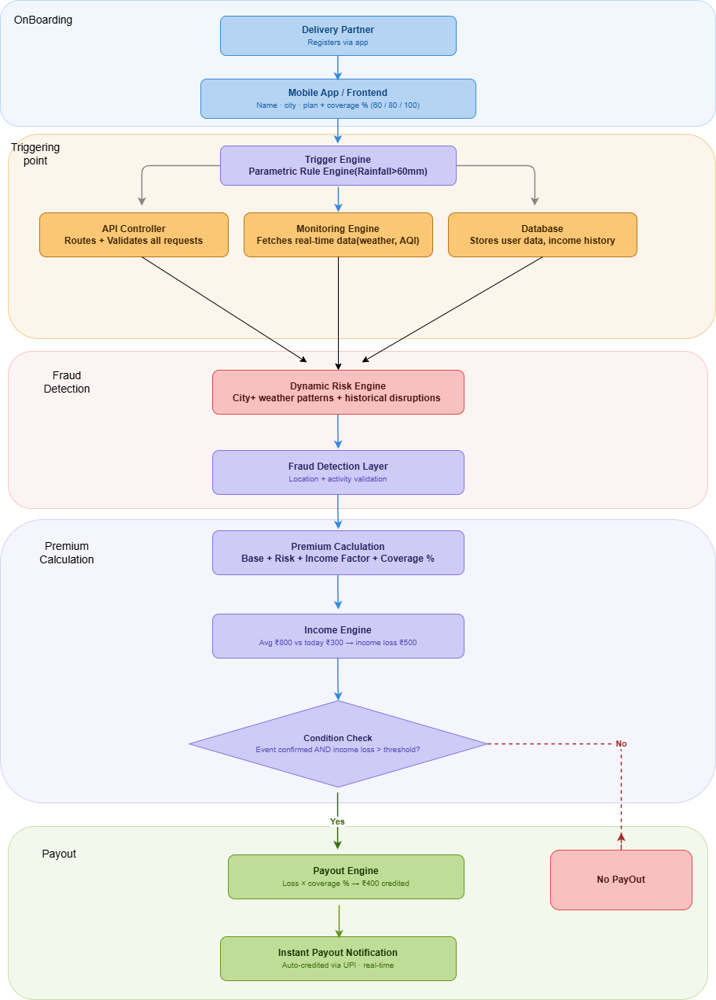
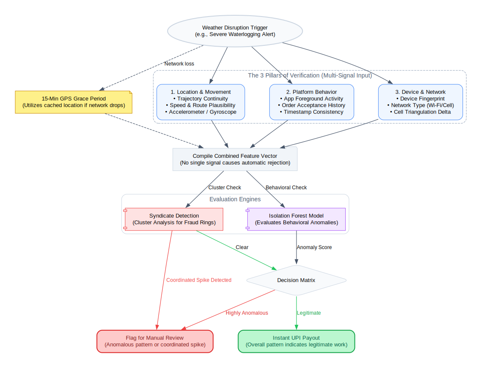

  

  <h1>CashUrance: AI-Powered Income Protection for Delivery Partners</h1>
  
<b>Developed by Team D.E.V (Deploy - Execute - Vanish)</b>

> [!NOTE]
> CashUrance is an AI-enabled, event-driven parametric income-protection platform for delivery workers. This repository is an active monorepo implementation (Flutter app + Admin Web + Node/Python backend).

---

## Table of Contents
1. [Problem Statement & Target Persona](#1-problem-statement--target-persona)
2. [Insurance Product Definition](#2-insurance-product-definition)
3. [Weekly Premium Design](#3-weekly-premium-design)
4. [Parametric Trigger Framework & Governance](#4-parametric-trigger-framework--governance)
5. [Eligibility & Payout Design](#5-eligibility--payout-design)
6. [Current Platform Architecture (Implemented)](#6-current-platform-architecture-implemented)
7. [AI & ML System (Implemented)](#7-ai--ml-system-implemented)
8. [Adversarial Defense & Anti-Spoofing Strategy](#8-adversarial-defense--anti-spoofing-strategy)
9. [Tech Stack](#9-tech-stack)
10. [Live Prototype](#10-live-prototype)

---

## 1. Problem Statement & Target Persona

### 1.1 The Industry Gap
India's quick-commerce ecosystem depends on delivery workers whose earnings are tightly linked to completed orders. Weather and mobility disruptions (rain, heat, AQI spikes, traffic collapse) can shut down earning opportunities instantly. Traditional claim-heavy insurance is too slow and frictional for this use case.

### 1.2 Delivery Persona Selection
- Chosen Segment: hyperlocal grocery and food delivery partners.
- Work Characteristics:
  - 2-3 km operating zones
  - Earnings linked to completed orders
  - Outdoor operational exposure
  - High dependency on city-level mobility and environmental conditions

### 1.3 Persona-Based Workflow Scenarios
- Scenario A (Eligible): policy active before event + worker shows earning intent + trigger occurs in registered zone.
- Scenario B (Ineligible): policy purchased after event start, or worker not eligible due to validation rules.

  

---

## 2. Insurance Product Definition

### 2.1 Core Product & Cycle
- Product Type: weekly parametric income protection.
- Coverage Window: weekly cycle.
- Claim Method: automated, no manual claim form.

### 2.2 Coverage Scope and Boundaries
Coverage applies when:
1. Worker has an active policy.
2. Trigger occurs in the relevant operating geography.
3. Trigger is validated from external data signals.
4. Worker satisfies eligibility checks.

> [!WARNING]
> Exclusions currently include voluntary inactivity and non-trigger personal/asset losses.

---

## 3. Weekly Premium Design

### 3.1 Premium Formula
$$Premium = \text{Base Rate} + \text{Zone Risk Loading} + \text{Weather Volatility} + \text{Mobility Risk} - \text{Safety Incentive Discount}$$

### 3.2 Current Implementation Notes
- Premium is generated in Python and consumed by Node.
- Node also supports fallback premium scoring when ML service is unavailable.
- Dynamic risk-based pricing is used through zone/weather/mobility loadings with a safety discount.
- App surfaces a Premium Intelligence breakdown (base, zone, weather, mobility, safety discount, model confidence).

---

## 4. Parametric Trigger Framework & Governance

### 4.1 Current Implemented Trigger Inputs (Live)
The running backend derives triggers from live Open-Meteo feeds:
- Rain/Flood signal
- Heat signal
- AQI signal
- Derived traffic stress signal

### 4.2 Current Trigger Levels (Implementation)
- Rain: Low/Moderate/High based on precipitation intensity.
- Heat: Low/Moderate/High based on temperature.
- AQI: Good/Moderate/High based on US AQI.
- Traffic: Derived from rain + AQI + rush-hour profile.

---

## 5. Eligibility & Payout Design

### 5.1 Current Eligibility Layers (Implemented)
- Active policy window validation
- Zone-status trigger gating
- Worker online intent validation
- Event-wise payout status handling and event IDs

### 5.2 Current Payout Design (Implemented)
- Severity-adjusted payout behavior (normal/severe/catastrophic pathways)
- Policy activity and zone trigger checks before payout status transitions
- App-visible payout history and trigger metadata

### 5.3 Cap Logic
$$\text{Max Payout} = \min(0.75 \times \text{Average Daily Income}, 1000)$$

This cap logic remains aligned with pool sustainability and anti-abuse goals.

---

## 6. Current Platform Architecture (Implemented)

### 6.1 Monorepo Applications
- `cashurance`: Flutter mobile/web client
- `cashurance-admin-web`: React + Vite admin interface
- `cashurance-backend`: unified backend runner for Node + Python

### 6.2 Platform Components (Clear Separation)
- User App (`cashurance`): partner onboarding, policy purchase, premium intelligence, payout history.
- Backend (`cashurance-backend`): auth, policy/state orchestration, trigger ingestion, payout decision APIs, admin APIs.
- Admin App (`cashurance-admin-web`): operator login, monitoring views, and policy/payout oversight tools.

### 6.3 Backend Runtime Shape
- Node service (Express + SQLite): auth, app state, admin APIs
- Python service (FastAPI): premium scoring endpoint
- Root launcher starts both runtimes through a single command

### 6.4 API Surface
- Health: `/health`
- Versioned APIs: `/api/v1/auth/*`, `/api/v1/app/*`, `/api/v1/admin/*`

### 6.5 Advanced Trigger API Integrations (Integration-Ready)
- Traffic disruption signals: adapter layer prepared for Google Maps Traffic, TomTom Traffic, and HERE Traffic APIs.
- Public disruption signals: adapter-ready ingestion for city incident/news streams (for strike/protest and shutdown events).
- Weather-source quorum expansion: structure supports multi-provider blending beyond Open-Meteo for higher trigger confidence.
- Governance mode: advanced feeds are handled as optional trigger enrichers and can be enabled per zone policy.

---

## 7. AI & ML System (Implemented)

| Module | Status | Current Model/Logic |
| :--- | :--- | :--- |
| Premium Calculation | Implemented | Python linear-risk scoring service with explainable component breakdown |
| Trigger Evaluation | Implemented | Rule-based trigger mapping from live weather/air inputs |
| Payout Decisioning | Implemented | Policy + intent + trigger-based status transitions |
| Behavioral Validation | Partial | Online-intent and operational validation signals in backend |
| Explainability Dashboard | Partial | In-app premium breakdown + model name/confidence |

---

## 8. Adversarial Defense & Anti-Spoofing Strategy

### 8.1 Implemented Integrity Controls
- Registered zone and location-aware logic in auth/app flow
- Geofence-style validation rules in login flow
- Event and activity logging for operational traceability

  

---

## 9. Tech Stack

### User App (`cashurance`)
- Flutter (Dart)
- Provider (state management)
- HTTP client (`http`)
- Geolocator + Flutter Map + LatLong2 (location and map flows)
- Image Picker (document/media capture)
- Google Fonts + Material UI

### Backend (`cashurance-backend`)
- Node.js 20 runtime
- Express 5 + CORS (REST API layer)
- SQLite3 (persistence)
- Python 3 premium engine with FastAPI + Uvicorn
- Node-Python orchestration via `scripts/start-backends.js`

### Admin App
- React + Vite (admin interface stack)

### Data and Signals
- Open-Meteo live weather/air quality feeds (trigger derivation)
- Traffic API feeds (integration-ready): Google Maps Traffic, TomTom Traffic, HERE Traffic
- Strike/disruption signal APIs (integration-ready): city incident/news event ingestion for protest, strike, and shutdown alerts
  
### Deployment and Infrastructure
- DigitalOcean Droplet (Ubuntu Linux runtime)
- PM2 (process supervision for backend services)
- Python virtual environment (`python/.venv`) for isolated Python deps
- UFW firewall configuration (ports 22/3000/8001 in deployment script)
- Cloudflare Quick Tunnel (`cloudflared`) for temporary HTTPS backend exposure
- Firebase Hosting for deployed web prototype

### Automation and Operations
- PowerShell deployment automation (`update_all_from_pc.ps1`)
- Bash deployment bootstrap (`deploy_from_scratch.sh`)
- NPM + pip dependency workflows

---

## 10. Live Prototype

- Web prototype:
  - https://dev-deploy-execute-vanish.web.app/

---

  <i>Deploy - Execute - Vanish</i> 
  <b>Team D.E.V</b>

